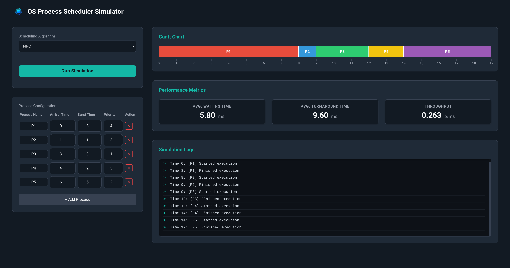
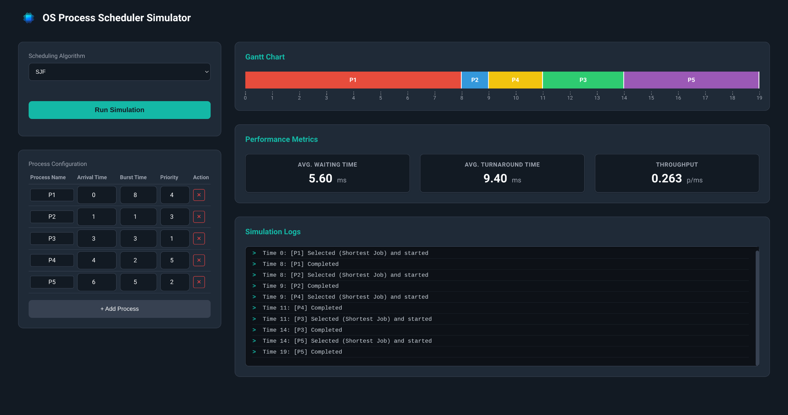
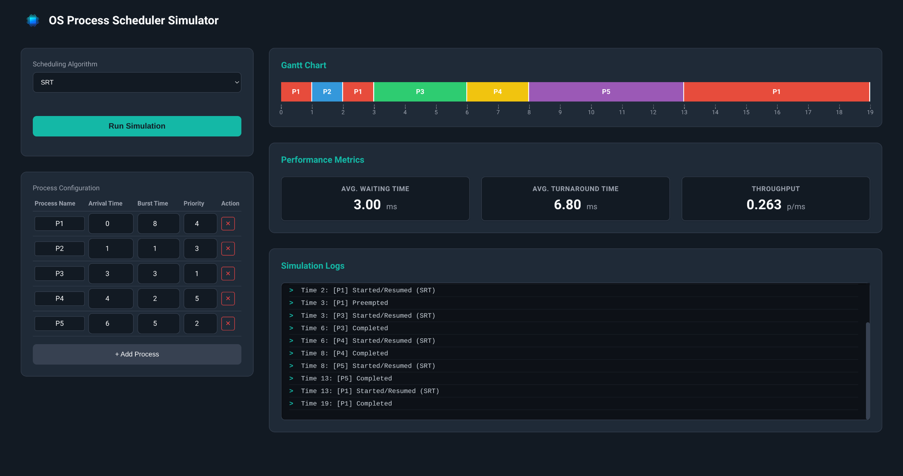
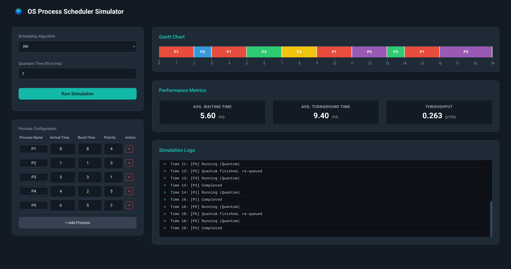
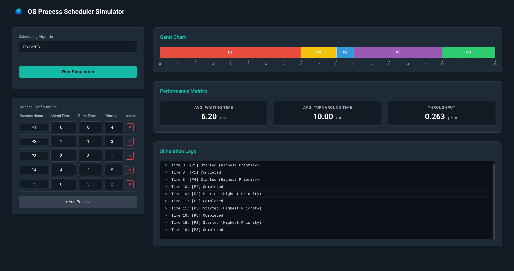
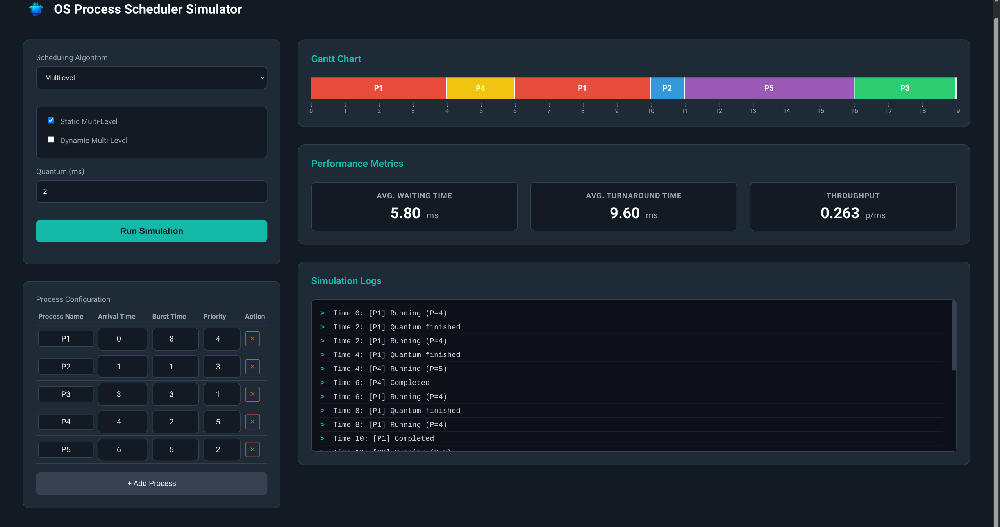
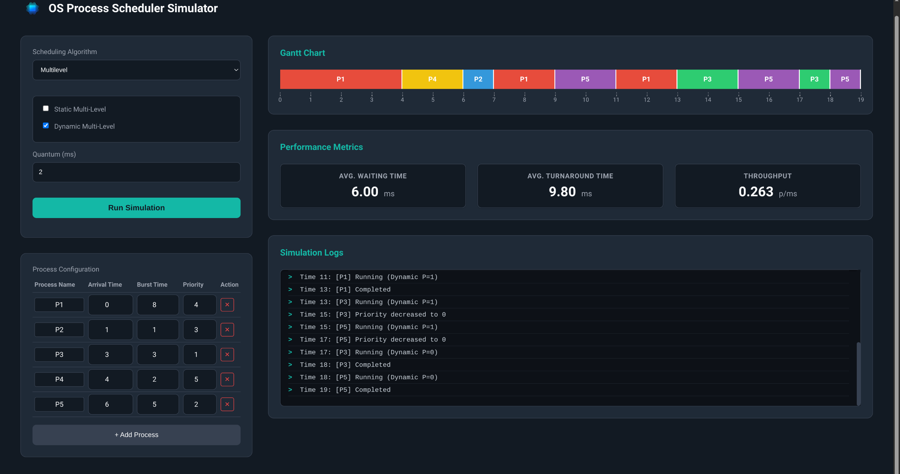

# OS Process Scheduler Simulator

A beautiful, interactive **Operating System CPU Scheduling Algorithms Simulator** built with a **C backend** (native executables) and a modern **React + Vite** frontend.

Visualize how classic and advanced scheduling algorithms work in real-time with Gantt charts, detailed logs, and performance metrics.


## Features

- 7 CPU Scheduling Algorithms implemented in pure C:
  - First Come First Served (FIFO / FCFS)
  - Shortest Job First (SJF) – Non-preemptive
  - Shortest Remaining Time (SRT) – Preemptive
  - Round Robin (RR) with configurable quantum
  - Non-Preemptive Priority Scheduling
  - Multilevel Queue (Static)
  - Multilevel Feedback Queue (Dynamic – aging)

- Real-time Gantt Chart visualization
- Step-by-step simulation logs
- Performance metrics: Avg Waiting Time, Avg Turnaround Time, Throughput
- Fully editable process table (add/remove/modify processes)
- Responsive and Responsive UI with dark theme

## Project Structure
OS-Scheduler-Simulator/
├── algorithms/
│   └── source/          ← C source files for each algorithm
│   └── build/           ← Compiled executables (generated)
├── backend/
│   ├── server.c         ← Mongoose-based HTTP server
│   ├── mongoose.c/h     ← Embedded web server
│   └── c_backend        ← Compiled server (generated)
├── frontend/
│   ├── public/
│   ├── src/
│   │   ├── components/  ← GanttChart, Metrics, LogPanel, ProcessTable
│   │   └── App.js
│   └── package.json
├── process.h            ← Shared struct definition
├── params.txt           ← Default process configuration
├── Makefile             ← Builds all C algorithms
├── run_backend.sh       ← Build & start C backend
└── run_frontend.sh      ← Start React development server
text## Screenshots


> Running FIFO with 5 processes – Gantt chart, logs, and metrics

## How to Run Locally

### Prerequisites

- GCC (or any C compiler)
- Make
- Node.js ≥ 16
- npm or yarn

### Step-by-Step Setup

#### 1. Clone the repository
```bash
git clone https://github.com/SameurISMAIL/OS-Scheduler-Simulator.git
cd OS-Scheduler-Simulator
2. Start the Backend (C Server)
Open a terminal and run:
Bashchmod +x run_backend.sh
./start_backend.sh
This will:

Compile all scheduling algorithm executables
Compile the lightweight C HTTP server (using Mongoose)
Start the API server at http://localhost:3001

Keep this terminal running.
3. Start the Frontend (React App)
Open a second terminal:
Bashchmod +x run_frontend.sh
./start_frontend.sh
This will:

Install dependencies (if needed)
Start Vite dev server at http://localhost:5173 (or http://localhost:3000)

The app will open automatically in your browser.
Now you can select any algorithm, edit processes, change quantum, and run simulations!
Default Process Configuration
Edit params.txt to change the initial processes loaded on startup:
txt# PID, Arrival, Burst, Priority
P1, 0, 8, 4
P2, 1, 1, 3
P3, 3, 3, 1
P4, 4, 2, 5
P5, 6, 5, 2


## Screenshots

### First Come First Served (FIFO)


---

### Shortest Job First (SJF)


---

### Shortest Remaining Time (SRT)


---

### Round Robin (RR)


---

### Priority Scheduling


---

### Multilevel Queue (Static)


---

### Multilevel Feedback Queue (Dynamic)



Author
Sameur ISMAIL
GitHub: @SameurISMAIL
